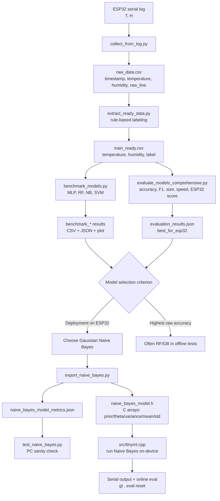

# ML Script Commands (Linear, copy-paste friendly)

This document lists the exact command sequence from collecting raw data on the ESP32 serial log, extracting a train-ready CSV, training/exporting a Gaussian Naive Bayes model, and producing the deployable C header (`naive_bayes_model.h`).

Notes about paths:
- All ML scripts live in the `ml/` folder. The scripts generally resolve plain filenames relative to `ml/` (the script directory). To avoid accidental double-`ml/ml` paths, either:
	- Run commands from the project root but pass plain filenames (e.g. `--input raw_data.csv`), or
	- `cd ml` and run the scripts with plain filenames.
	- Alternatively, pass an absolute path to any `--input`/`--output` option.

## 1) Activate Python environment

From project root (PowerShell):

```powershell
.\.venv310\Scripts\Activate.ps1
```

## 2) Collect raw data from ESP32 serial log

Run this while the ESP32 prints sensor lines to serial. Replace `COM4` and `115200` with your port/baud.

From project root (recommended):

```powershell
python ml/collect_from_log.py --port COM4 --baud 115200
```

Alternative: go into the `ml` folder and run:

```powershell
cd ml
python collect_from_log.py --port COM4 --baud 115200
```

Default output file is `ml/raw_data.csv` (or `raw_data.csv` when running inside `ml/`). If your collector supports `--output`, you can pass it explicitly.

## 3) Extract train-ready data (rule-based labeling)

This converts `raw_data.csv` -> `train_ready.csv` with columns: `temperature, humidity, label`.

From project root (call the script in `ml/` and pass a plain filename):

```powershell
python ml/extract_ready_data.py --input raw_data.csv --output train_ready.csv
```

Or, run from inside `ml/`:

```powershell
cd ml
python extract_ready_data.py --input raw_data.csv --output train_ready.csv
```

Important: do NOT pass `--input ml/raw_data.csv` when invoking `python ml/extract_ready_data.py` from the project root — that may be interpreted relative to the script directory and produce `ml/ml/raw_data.csv`. Use a plain filename or an absolute path.

- To exclude invalid rows (label `Không hợp lệ`):

```powershell
python ml/extract_ready_data.py --input raw_data.csv --output train_ready.csv --exclude-invalid
```

Check the produced file: `ml/train_ready.csv`.

## 4) Install training dependencies (once)

```powershell
pip install numpy scikit-learn joblib
```

## 5) Train and export Gaussian Naive Bayes -> C header

This step trains a GaussianNB on `train_ready.csv` and writes both a metrics JSON and a C header.

From project root (call the script in `ml/`):

```powershell
python ml/export_naive_bayes.py --input train_ready.csv --prefix naive_bayes_model
```

Or from inside `ml/`:

```powershell
cd ml
python export_naive_bayes.py --input train_ready.csv --prefix naive_bayes_model
```

Outputs (placed inside `ml/`):
- `naive_bayes_model.h`         (C header with arrays — include in your firmware)
- `naive_bayes_model_metrics.json` (train/test accuracy + parameters)

If the script complains `Input CSV not found: ...` either:
- Use a plain filename when calling the script (so it resolves to `ml/`), or
- Give an absolute path: `--input D:\full\path\to\train_ready.csv`.

## 6) Quick sanity-check (PC)

Run the test script to evaluate the exported model on some inputs:

```powershell
python ml/test_naive_bayes.py --model naive_bayes_model_metrics.json --temperature 26.5 --humidity 48.0
```

From project root, prefix with `ml/` if needed:

```powershell
python ml/test_naive_bayes.py --model ml/naive_bayes_model_metrics.json --temperature 26.5 --humidity 48.0
```

## 7) Use the header on ESP32

Copy `ml/naive_bayes_model.h` into the firmware `include/` folder or update your build to read it from `ml/`. Example:

```powershell
copy ml\naive_bayes_model.h include\
```

Then build and upload with PlatformIO:

```powershell
pio run
pio run -t upload --upload-port COM4
pio device monitor --port COM4 --baud 115200
```

## 8) End-to-end checklist (one-liners)

From project root, copy-paste these commands in order:

```powershell
.\.venv310\Scripts\Activate.ps1
python ml/collect_from_log.py --port COM4 --baud 115200
python ml/extract_ready_data.py --input raw_data.csv --output train_ready.csv
pip install numpy scikit-learn joblib
python ml/export_naive_bayes.py --input train_ready.csv --prefix naive_bayes_model
copy ml\naive_bayes_model.h include\
pio run -t upload --upload-port COM4
```

If any step fails with a FileNotFoundError, re-run the failing command but pass an absolute path for `--input`/`--output`.

---
If you want, I can also:
- run the extraction command here to confirm behavior on your repository, or
- patch `ml/export_naive_bayes.py` so it accepts multi-segment relative paths the same way we adjusted `extract_ready_data.py`.

# ML Script Commands

## 1) Activate Python environment

From project root:

```powershell
.\.venv310\Scripts\Activate.ps1
```

## 2) Collect raw data from ESP32 serial log

From project root:

```powershell
python ml/collect_from_log.py --port COM4 --baud 115200
```

From inside `ml`:

```powershell
python collect_from_log.py --port COM4 --baud 115200
```


## 3) Extract train-ready data

From project root:

```powershell
python ml/extract_ready_data.py --input ml/raw_data.csv
python ml/extract_ready_data.py --input ml/raw_data.csv
```

From inside `ml`:

```powershell
python extract_ready_data.py --input raw_data.csv
python ml/extract_ready_data.py --input ml/raw_data.csv
```

## 4) Train model and export for device

Install dependencies (once):

```powershell
pip install numpy scikit-learn matplotlib
```

From project root, export the selected Naive Bayes model:

```powershell
python ml/export_naive_bayes.py --input train_ready.csv --prefix naive_bayes_model
```

From inside `ml`:

```powershell
python export_naive_bayes.py --input train_ready.csv --prefix naive_bayes_model
```

Outputs created in `ml`:

- `naive_bayes_model.h`
- `naive_bayes_model_metrics.json`

Note:

Naive Bayes does not have a native TensorFlow Lite export target. The deployable artifact is the C header with parameters.

## 5) Output files

- `raw_data.csv`: collected log data
- `train_ready.csv`: extracted data ready for training

## 6) Notes

- `extract_ready_data.py` writes `train_ready.csv` beside the script file.
- If you want to exclude the `Không hợp lệ` class, use:

```powershell
python extract_ready_data.py --input raw_data.csv --exclude-invalid
```

The selected deployment model is Gaussian Naive Bayes; use the generated C header on ESP32.

## 7) Test the selected model interactively on PC

From project root:

```powershell
python ml/test_naive_bayes.py --model ml/naive_bayes_model_metrics.json
```

From inside `ml`:

```powershell
python test_naive_bayes.py --model naive_bayes_model_metrics.json
```

Or pass values directly:

```powershell
python test_naive_bayes.py --model naive_bayes_model_metrics.json --temperature 26.5 --humidity 48.0
```

## 8) Benchmark all models and choose the best one

Install dependency (once):

```powershell
pip install joblib
```

From project root:

```powershell
python ml/benchmark_models.py --input train_ready.csv --prefix benchmark
```

From inside `ml`:

```powershell
python benchmark_models.py --input train_ready.csv --prefix benchmark
```

Outputs:

- `benchmark_results.csv`
- `benchmark_results.json`
- `benchmark_comparison.png`
- model artifacts for each benchmarked model


python ml/evaluate_models_comprehensive.py --input train_ready.csv

## 9) Deploy and run model on ESP32 (C/C++)

### Embed model header

The project uses TensorFlow Lite Micro model header:

- `include/dht_anomaly_model.h`

`src/tinyml.cpp` maps the model C-array to a readable alias:

- `kAnomalyModelCArray`

### Build and upload

From project root:

```powershell
pio run
pio run -t upload --upload-port COM4
pio device monitor --port COM4 --baud 115200
```

### Inference loop

TinyML task runs every 5 seconds and prints:

- Input used for inference (`T`, `H`)
- Full output tensor
- Predicted label index and confidence

### Optional fixed-input mode for quick sanity check

Add these flags in `platformio.ini` if you want deterministic test input:

```ini
build_flags =
	...
	-DTINYML_USE_FIXED_INPUT=1
	-DTINYML_FIXED_TEMP=30.0f
	-DTINYML_FIXED_HUMI=70.0f
```

## 10) Hardware accuracy evaluation (required)

Use serial commands to provide ground-truth while the board is running:

- `gt <label>`: set current ground-truth class
- `gt off`: disable accuracy comparison
- `eval reset`: clear counters

Example flow in serial monitor:

1. `eval reset`
2. Put the environment into one known state/class
3. Send `gt 4` (example label)
4. Keep running for N samples
5. Change environment and update `gt <new_label>`
6. Repeat for all classes

Runtime output includes:

- `total`: number of evaluated samples
- `correct`: number of correct predictions
- `accuracy`: online accuracy (%)

## 11) Performance discussion checklist

When writing your report/discussion, include:

- Accuracy in stable conditions vs transition conditions
- Typical confidence range for correct and incorrect predictions
- Latency per inference (from monitor timestamps)
- Memory constraints (tensor arena size, task stack)
- Sensor noise and calibration impact
- Recommended threshold tuning or retraining needs

## 12) End-to-end ML pipeline diagram


